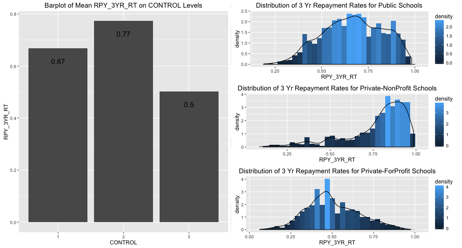
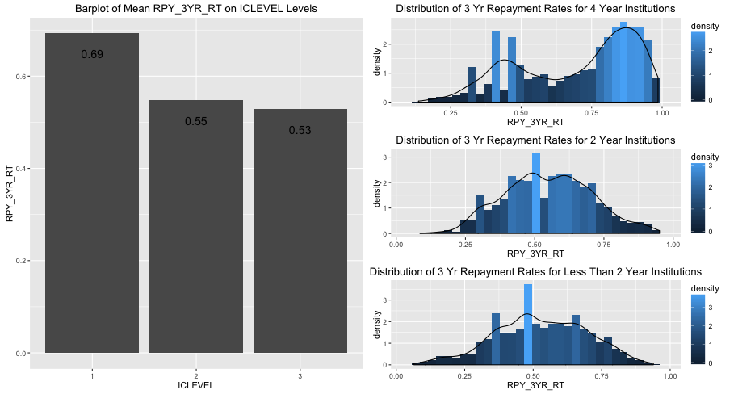
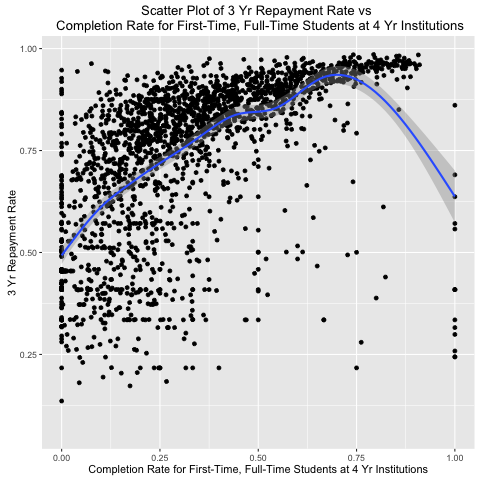
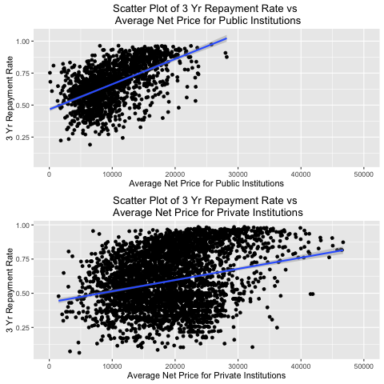

```{r setup, include=FALSE}
knitr::opts_chunk$set(echo = TRUE)
```

methods,results, analysis, conclusion, thank you slide


# Client Profile

## Client Profile

Our client is a credit institution that provides financial aid to students. The managers are interested in expanding their customer base but they would also like that most of the loans be payed back.

Main Question: What features and details of a school make it reliable for credit?

# Data

## Data

1. [College Scorecard](https://ed-public-download.apps.cloud.gov/downloads/CollegeScorecard_Raw_Data.zip): data on student completion, debt and repayment, earnings, and more. The files include data from 1996 through 2016 for all undergraduate degree-granting institutions of higher education. This data was last updated on September 13th, 2016.
2. [Post-school earnings](https://ed-public-download.apps.cloud.gov/downloads/Most-Recent-Cohorts-Treasury-Elements.csv): more current and detailed information about student post-school earnings for all undergraduate degree-granting institutions of higher education


Complete College Scorecard Data is available at https://collegescorecard.ed.gov/data/

Documentation on all data is available at https://collegescorecard.ed.gov/data/documentation/

# Methods

## Methods

Response Variable: 3 Year Repayment Rate

1. Data Cleaning:
  * replacing PrivacySuppressed columns with NULL
  * Remove all columns with at at most 50% NULL
  * replace remaining NULL columns with column means

2. Variable Selection:
  * Manually organize remaining columns by category to pick out variables relevant to research question
  * Run correlation matrix on variables and select those with at least absolute value of .5 correlation to 3 year repayment rate
  * Run basic OLS regression to narrow down the statistically significant variables

# Results

## Visualization
**Distribution of 3 Year Repayment Rate by Institution Type**



## Visualizations
**Distribution of 3 Year Repayment Rate by n Year Institutions**



## Visualizations
**Scatter Plot: Completion Rate Rate vs. 3 Year Repayment Rate**



## Visualizations
**Scatter Plot: Net Price for Institution Type vs. 3 Year Repayment Rate**




## Table 1:Predictors with high correlation
```{r echo = FALSE, cache = FALSE}

load('../data/RData/ols.RData')
load('../data/RData/lasso.RData')
load('../data/RData/ridge.RData')
load('../data/RData/pcr.RData')
load('../data/RData/plsr.RData')
load('../data/RData/correlation.RData')
suppressWarnings(library(pander))
```
```{r, results = "asis", fig = TRUE, include =TRUE, echo = FALSE, eval=TRUE, out.width=3, out.height=6}

pander(high_cor_rpy3yr_tbl)


```
## Table 2: MSE of regressions

```{r , results = "asis", fig = TRUE, include =TRUE, echo = FALSE, eval=TRUE}
mse <- data.frame(rpy_3yr_regsum$sigma, rpy3yr_lasso_test_mse, rpy3yr_ridge_test_mse,
                  rpy_pcr_test_mse, rpy_pls_test_mse)
colnames(mse) <- c("OLS", "Lasso", "Ridge", "PCR", "PLSR")
pander(mse)

```
## Table 3: Ridge Coefficients

```{r , results = "asis", fig = TRUE, include =TRUE, echo = FALSE, eval=TRUE}
ridge_coef <- as.data.frame(rpy3yr_rr_coef[-1,])
colnames(ridge_coef) <- "Coefficients"
pander(ridge_coef)
```


# Analysis

## Table 4: Top 8 Schools
```{r , results = "asis", fig = TRUE, include =TRUE, echo = FALSE, eval=TRUE, size = 200}
load('../data/RData/tsa_data.RData')
pander(top_100[1:8,])


```


# Conclusion

## Conclusion

Our regressions indicated that our client should pay closest attention to student completion rates, as these were the best predictor of repayment on federal loans for both four-year and less-than-four-year institutions. In addition, our regression analysis showed that postgraduate income - particularly the percentage of graduates earning very low incomes - was a good predictor of repayment rates.

We believe that repayment rates on federal loans will likely be correlated with the same factors as repayment rates on private loans, so these factors are good predictors of the schools in which our client should offer loans.

## Conclusion

In addition to regression, we performed time series analysis to determine which schools are likely to have the highest future repayment rates, based on their past and current rates over six years. We created a list of top 100 colleges by predicted future repayment rates - our client can use this list to identify schools that are likely to well better in the future, in order to shift their efforts to those schools.


# Thank You!
